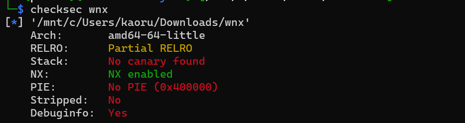
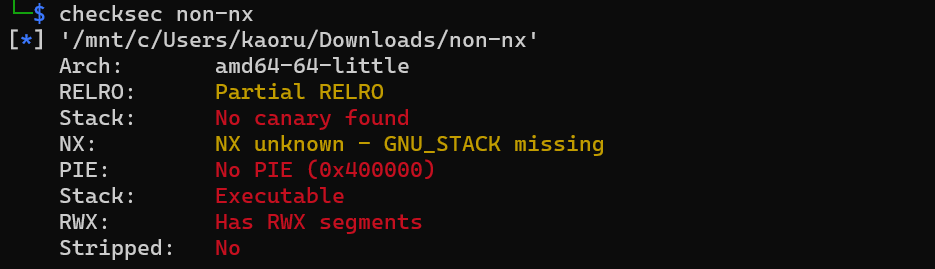

# Understanding NX Through Exploitation: Why ret2win Stops Working

## 1. From ret2win to Its Limitations

Ret2win works in simple environments, but it does not work reliably in real systems where basic defenses are enabled.

One of the most fundamental protections is NX (No-eXecute), which prevents certain memory regions from being executed as code.

## 2. What NX Actually Does

NX, also known as Data Execution Prevention (DEP), is a memory protection mechanism that prevents execution of code from non-executable regions such as the stack.

This means that even if an attacker successfully overwrites memory and injects shellcode, the CPU will refuse to execute it.

NX is typically enabled at compile time and enforced at runtime, and its effect can be observed through memory permissions.

## 3. Experiment: With and Without NX

To understand how NX affects exploitation, I prepared a simple vulnerable C program and observed its behavior under different configurations.

The goal is to compare what happens when execution from the stack is allowed versus when it is blocked.

This experiment highlights a key limitation of classic stack-based exploitation techniques.

Below is the test program:

  
### 3.1 Static vs. Dynamic Observation

After compiling the program with and without NX, the binaries were named wnx and non-nx.

I first examined both binaries using the `checksec` tool.

In the non-nx binary, the NX status was reported as "NX unknown - GNU_STACK missing".

Next, I inspected the runtime memory layout using `info proc mappings` in GDB. The stack is mapped without execute permissions (no "x" flag) when inspecting the file with NX.

The stack is mapped as executable (with the "x" flag) when inspecting the file without NX.

Although the static analysis reported the NX status as unknown, runtime inspection showed that the stack was mapped as executable.

This indicates that actual memory permissions are determined at runtime and may not always be accurately reflected by static analysis alone.

### 3.2 Attempt to Execute Code on the Stack

#### Goal

The goal of this experiment is to observe what happens when control flow is redirected to the stack, and to understand how modern protections affect execution.

This highlights a key limitation of classic stack-based exploitation techniques.

#### Setup

To prepare the payload, I identified the stack address and calculated the offset required to overwrite the return address.

The following Python script was used to generate the payload.

#### Observation

The wnx binary was executed in GDB using the generated payload.

By placing a breakpoint at the vuln function, it was possible to observe the program state immediately before and after the payload was processed.

At the moment of the crash, the stack clearly contains injected data (0x90 bytes), and the return instruction is about to transfer control to this region.

This indicates that the program attempts to execute code from the stack, but fails immediately with a segmentation fault.

Interestingly, the same behavior was observed in the non-nx binary.

#### Interpretation

This experiment shows that control flow hijacking is still possible, as the instruction pointer can be redirected to arbitrary memory locations.

However, execution from the stack is not reliably possible in this environment.

Even when the stack appears executable at runtime, modern systems may enforce additional constraints that prevent successful execution.

This demonstrates that classic stack-based code injection techniques are no longer reliable on modern systems.

## 4. Why the Attack Fails

## 5. What Comes Next: Bypassing NX

## 6. Key Insight

## 7. What I Learned
