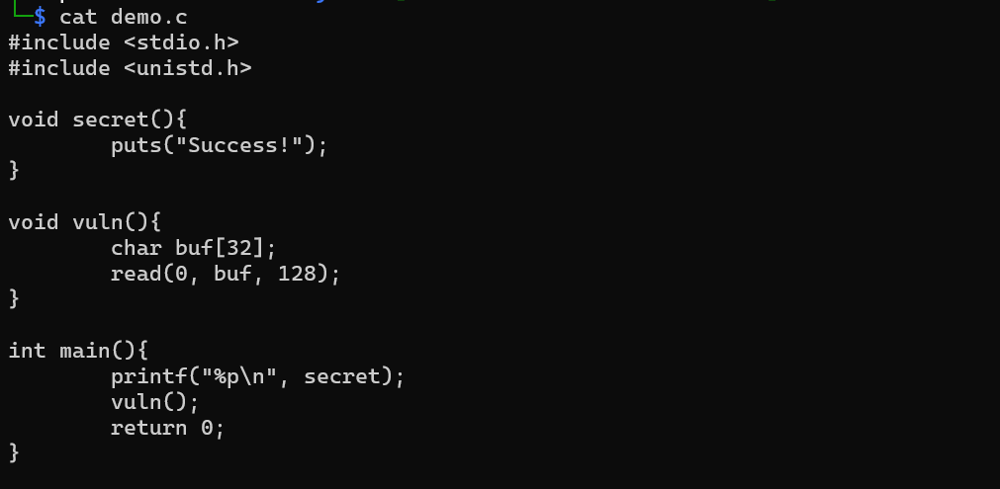
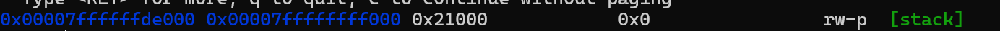
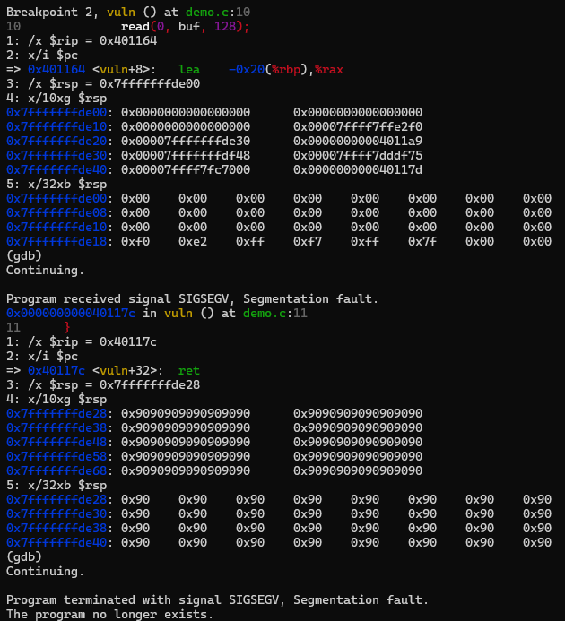

# Understanding NX Through Exploitation: Why ret2win Stops Working

## 1. From ret2win to Its Limitations

Ret2win works in simple environments, but it does not work reliably in real systems where basic defenses are enabled.

One of the most fundamental protections is NX (No-eXecute), which prevents certain memory regions from being executed as code.

## 2. What NX Actually Does

NX (No-eXecute), also known as Data Execution Prevention (DEP), is a memory protection mechanism that prevents execution of code from non-executable regions such as the stack.

This means that even if an attacker successfully overwrites memory and injects shellcode, the CPU will refuse to execute it.

NX is typically enabled at compile time and enforced at runtime, and its effect can be observed through memory permissions.

## 3. Experiment: With and Without NX

To understand how NX affects exploitation, I prepared a simple vulnerable C program and observed its behavior under different configurations.

The goal is to compare what happens when execution from the stack is allowed versus when it is blocked.

This experiment highlights a key limitation of classic stack-based exploitation techniques.

Below is the test program:

  
### 3.1 Checking Memory Permissions

When NX is disabled, we can observe this state with `info proc mappings` in GDB. As following schreenshot, permission for stack is including execution (x).

When NX is enabled, we can check with `info proc mapping` in GDB, permission for stack is not including execution (x).

### 3.2 Attempt to Execute Code on the Stack

To observe how NX actually works, I attempted to execute code on the stack by redirecting control flow to a region filled with NOP instructions.

Although the instruction pointer was redirected to the stack, the instruction at that location (in this case, a ret instruction) could not be executed.

The program immediately terminated with a segmentation fault, indicating that execution from the stack is prohibited.

In this environment, it was not possible to observe successful execution with NX disabled, which reflects the behavior of modern systems where such protections are enforced consistently.

## 4. Why the Attack Fails

## 5. What Comes Next: Bypassing NX

## 6. Key Insight

## 7. What I Learned
